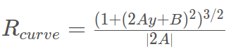

# Advanced-Lane-Lines

## Overview
In this project, I will implement computer vision technologies to achieve lane boundaries lane identification
by using a video from a front-facing camera on a car. 

The goals/steps of this project are the folloing:
  * Compute the camera calibration matrix and distortion coefficients given a set of chessboard images.
  * Apply a distortion correction to raw images.
  * Use color transforms, gradients, etc., to create a thresholded binary image.
  * Apply a perspective transform to rectify binary image ("birds-eye view").
  * Detect lane pixels and fit to find the lane boundary.
  * Determine the curvature of the lane and vehicle position with respect to center.
  * Warp the detected lane boundaries back onto the original image.
  * Output visual display of the lane boundaries and numerical estimation of lane curvature and vehicle position.

## Camera Calibration
In the real world, there is always a distortion when cameras use curved lenses to form an image. So it is necessary to 
use a method to reduce or remove the effect of distortion. Checkerboard patterns are useful for this tasks. I applied 
OpenCV functions **_findChessboardCorners_** and **_drawChessboardCorners_** to automatically find the draw corners in an image of
a chessboard pattern, like following figure:

Then I applied function **_calibrateCamera_** to measure distortion coefficients. After that **_undistort_** is used for
correcting distortion of image. The result like the below figure:

And I applied the camera calibration method on test images collected from real world,

## Color Transforms and Gradient Thresholded
In order to filter out the road lanes in each frame of video, Sobel operator is a good way to achieve it. In my project I applied Gradient threshold combination for these images, like following figures:

Also, I set a threshold for s parameter on hls color space and region of interest to filter the surrounding noise.
The points for region I am interested show on following table:

| Points                         |     Value                       |
|:---------------------:|:---------------------------------------------:|
| Lower Left                 | (Width x 0.1, Height)                                     |
| Upper Left              | (580,440) |
| Upper right         | (750,420)   |
| Lower right     | (Width x 0.95, Height)  |

The output figures is following:

## Perspective Transform
Because curvature of the lines is also a key parameter for self-driving car, but the images captured by front-facing camera on a car is hard to measure curvature of the lines. So we need to transform the image to top-down view, which is called perspective transform. 
I applied **_getPerspectiveTransform_** to compute perspective Transform, M and source and destination points shown on following table:

| Points                         |     Source                       |   Destination            |
|:---------------------:|:---------------------------------------------:|:---------------------------------------------:|
| Lower Left                 | (Width / 2) - 55 , (Height / 2) + 100)    |  ((Width / 4), 0)  |
| Upper Left              | ((Width / 6) - 10, Height) |        ((Width / 4), Height)|
| Upper right         | ((Width * 5 / 6) + 60, Height)   |    ((Width * 3 / 4), Height)   |
| Lower right     | ((Width / 2 + 55), Height / 2 + 100)  |   ((Width * 3 / 4), 0)     |

Then **_warpPerspective_** is applied with M to warp image, the output warped images like below:

## Find lane boundary 
The idea finding lane is that we use two hightest peaks from histogram as a starting point for determining where the lane lines are, and the use sliding windows moving upward in the image. I calculate the mean of pixels' value inside of left and 
right windows and re-center windows. Then I can collect the lane lines pixels and feed those into **_polyfit_** function.
The second order polynomial fit value can be got. like below figure:

And then after first frame, we don't need to use sliding windows to track the lane lines because it is inefficient and instead we can search in a margin around previous line position, like following figure:

## Measure Curvature of lanes
In order to measure curvatures of left lane and right lane, I implement the equation learnt from course

And also for our camera images, let's say 720 pixel in y-dimension indicate around 30 meters, and 700 pixels in x-dimension indicate around 3.7 meters. 

         ym_per_pix = 30/720
         xm_per_pix = 3.7/700
Furthermore, we can assume the camera is mounted at the center of the car, so offset of the lane center from the center of the image is distance from the center of lane. The equation like following:

       ((left_lane_position + right_lane_position) / 2 - image_width / 2 ) *  xm_per_pix
       
For above figure, the curvature and offset of center is shown in following table:

| Measurement                         |     Value(meter)                       |  
|:---------------------:|:---------------------------------------------:|
| Curvature of Left Lane                | 1985.594   | 
| Curvature of Right Lane                | 1251.354| 
| Offset of Lenter        | 0.393   |

## Drawing measurement of lines
I applied all of technique and computer vision algorithm on test image shown on following figure:

## Video Pipeline
The implementation Pipeline for project video can be found in the link:

[Project Video](https://youtu.be/mFVmcjrYePw)

## Discussion
I enjoyed doing the project and it was so much fun when I overcome each issues and learn techniques of computer vision. But my algorithm is perfect, there are some issue for challenge video and harder challenge video. In the challenge video, the edge detection is easily effect by the surrounding noise, such as median of main highway and some black line on road. And in harder challenge video, my pipeline crash!!! It can only detect lane in first 20 seconds period and also the detection is terrible. The surround noise and brightness of sun light ruin my pipeline. 
The improvements of my algorithm to overcome the above issues is following: 
   * Because in my algorithm I only used extract S value in hls color space and set a threshold for it, it is probably not good enough to perfect filter out yellow and white lanes in different brightness, so I will explore other values in hls to solve the issue.
   * region of interest can be more precise. For example, I can mask image for left lane  and right lane seperately, and then combine these two images together.
